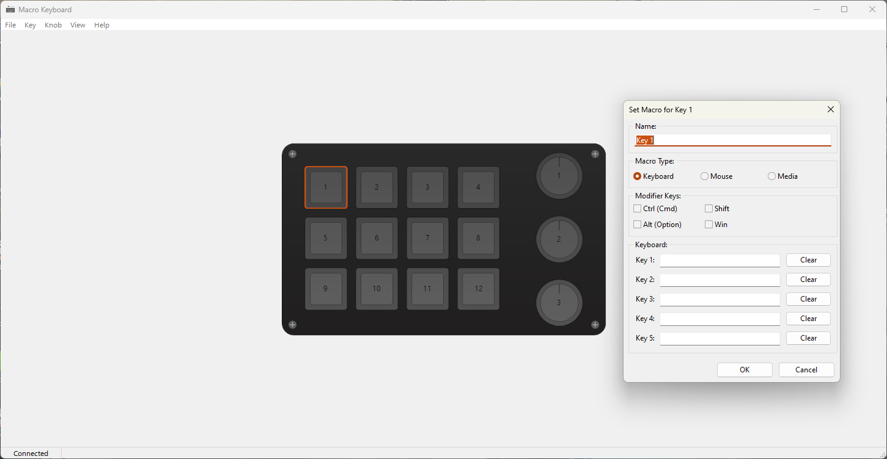
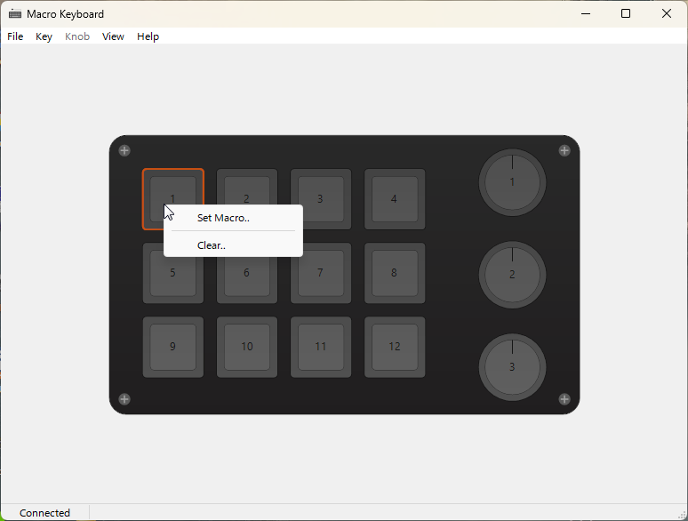
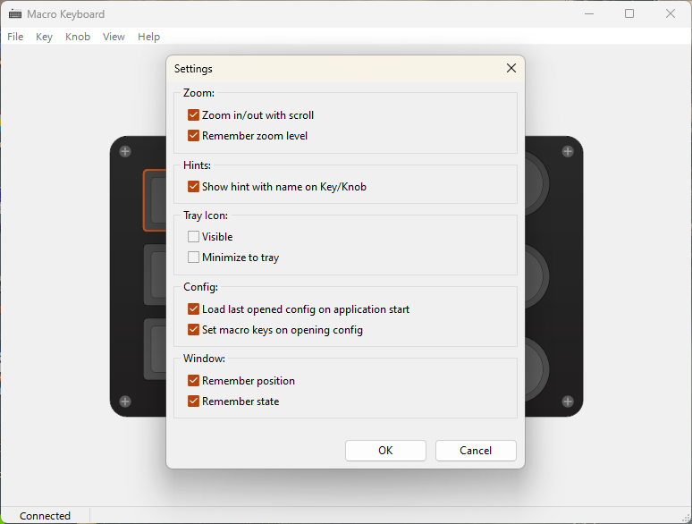

Custom software for a Maccro Keyboard with 12 buttons and 3 Knobs bought on Amazon.

Known bugs:
- Media "Mute", "Play/Pause" are not working. I need the original software to be able to compare the commands..

This is a first release, so there may be bugs that im not aware of. If you want to help, please submit a pull request.
Download link: https://github.com/erdesigns-eu/HID-Macro-Keyboard/blob/main/MacroKeyboard.rar

The software should be self explainatory, you can click a button/knob to select it and use the menu to clear or assign a macro, or you can use the context menu (right click). You can enable/disable some things in the settings, for now there is no installer because this is jus the first BETA release. After the first bugs will be fixed i will create a installer and maybe add some more functions, documentation, etc.

